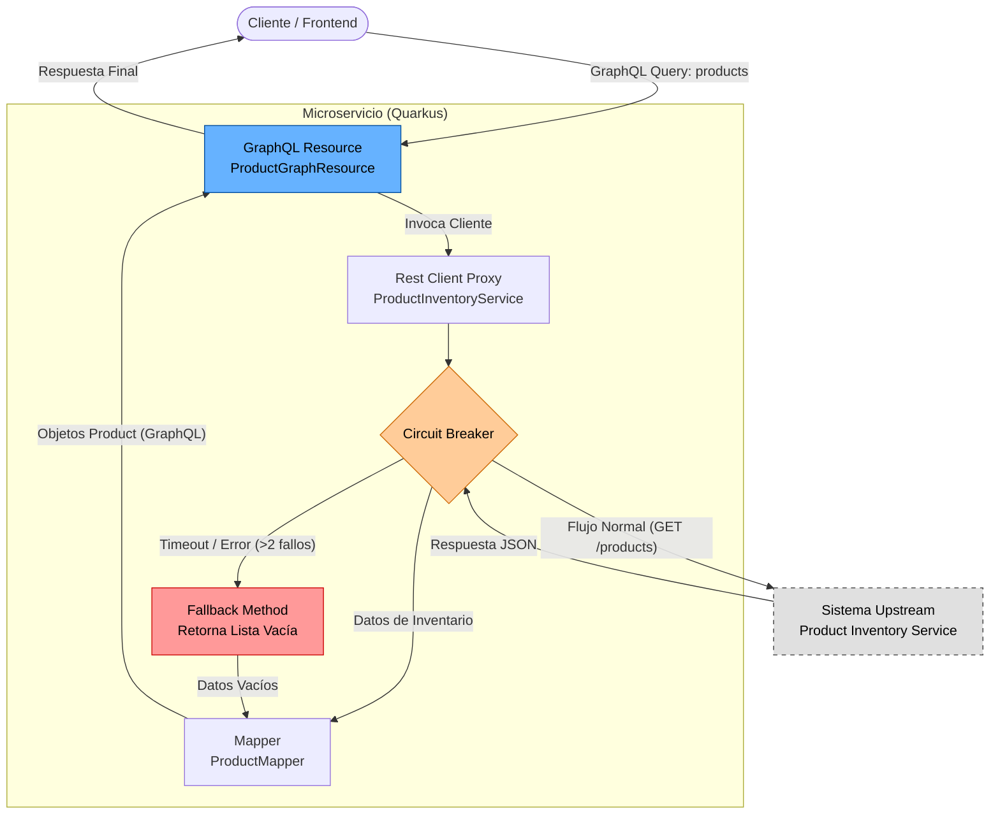

# MS OCP Matrix Retrieve Product Instances GraphQL

Microservicio responsable de exponer una API GraphQL para recuperar instancias de productos de clientes consumiendo un sistema de inventario upstream. Construido con Quarkus.

## Arquitectura



Este servicio actúa como un **BFF (Backend for Frontend)** o capa de fachada:
1.  **Expone**: Un Endpoint GraphQL (`/graphql`) con una consulta `products`.
2.  **Consume**: Una API REST legacy/upstream (`product-inventory-service`).
3.  **Resiliencia**: Implementa patrones de Circuit Breaker y Fallback para asegurar estabilidad cuando el servicio upstream es lento o no está disponible.


## API GraphQL

### Consulta: `products`
Recupera una lista de instancias de productos basada en criterios de búsqueda.

**Argumentos:**
- `type` (String): Filtro de tipo de producto.
- `publicId` (String): Identificador público del producto (ej. número de teléfono).
- `nationalId` (String): Documento de identidad del cliente.
- `nationalIdType` (String): Tipo de documento de identidad.

**Retorna:**
- Lista de objetos `Product` conteniendo características e información de cuotas.

**Ejemplo de Consulta:**
```graphql
query {
  products(publicId: "123456789") {
    id
    name
    status
    characteristics {
      name
      value
    }
  }
}
```

## Configuración

La aplicación se configura vía `application.properties`. Las configuraciones clave incluyen:

| Propiedad | Descripción | Defecto |
|----------|-------------|---------|
| `quarkus.rest-client.product-inventory-service.url` | URL del Servicio de Inventario Upstream | `http://10.4.43.93:8889/products-0.0.2` |
| `quarkus.rest-client.product-inventory-service.connect-timeout` | Tiempo de espera de conexión (ms) | `3000` |
| `quarkus.rest-client.product-inventory-service.read-timeout` | Tiempo de espera de lectura (ms) | `10000` |

## Desarrollo

### Ejecución en Modo Dev
```shell
./mvnw quarkus:dev
```
Acceda a la UI de GraphQL en [http://localhost:8080/q/graphql-ui](http://localhost:8080/q/graphql-ui).

### Empaquetado
```shell
./mvnw package
```
