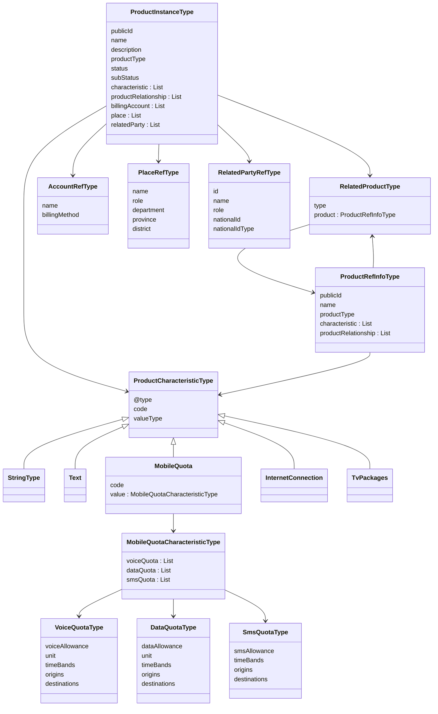

## Diagrama UML (Mermaid) DTOs `com.itelcorp.product.dto`

Este diagrama resume las relaciones principales (herencia y agregaciones) entre los DTOs generados del paquete `com.itelcorp.product.dto`.

### Descripción de clases (resumen)

- **ProductCharacteristicType**: base polimórfica para características; define `@type`, `code`, `valueType`.
  - **StringType** / **Text**: características simples con `name` y `value` (texto).
  - **MobileQuota**: característica compleja que encapsula cuotas de voz/datos/SMS.
    - **MobileQuotaCharacteristicType**: agrupa listas de **VoiceQuotaType**, **DataQuotaType**, **SmsQuotaType**.
  - **InternetConnection** / **TvPackages**: características genéricas con `value` dinámico (mapa JSON).

- **ProductInstanceType**: producto principal devuelto por el backend; contiene datos generales (publicId, name, descripción, tipo, estado) y agregaciones:
  - `characteristic`: lista polimórfica de `ProductCharacteristicType`.
  - `productRelationship`: relaciones con otros productos (bundle/subproductos).
  - `billingAccount`: referencias a cuentas (financial/billing).
  - `place`: ubicaciones asociadas.
  - `relatedParty`: partes relacionadas (cliente, usuario, etc.).

- **RelatedProductType**: relación de producto; incluye `type` y un `ProductRefInfoType` como producto relacionado.
- **ProductRefInfoType**: versión reducida de producto (publicId, name, productType) que puede tener sus propias características y relaciones anidadas.

- **AccountRefType**: referencia a cuenta; `name`, `billingMethod`, identificadores/href.
- **PlaceRefType**: referencia a lugar; incluye datos de localización (department, province, district, role).
- **RelatedPartyRefType**: referencia a parte relacionada; `id`, `name`, `role`, `nationalId`, `nationalIdType`.
